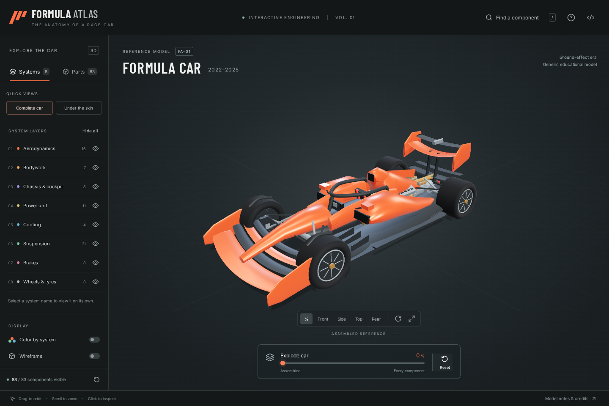

# Formula Atlas

An interactive 3D explorer of a Formula car, inspired by [Human Atlas](https://github.com/ashemag/human-atlas). Select a component, read what it does, hide the surrounding systems, or take the whole car apart.

83 selectable assemblies. Eight systems. No accounts, API keys, or backend.

[](https://vercel.com/new/clone?repository-url=https%3A%2F%2Fgithub.com%2Faintoniodev%2Fformula-atlas)



## Explore

- Orbit, pan, and zoom the car. Click or tap a mesh to inspect it.
- Toggle aerodynamics, bodywork, chassis, power unit, cooling, suspension, brakes, and wheels.
- Use **Under the skin** to reveal the machinery, or select a system name to show only that system.
- Search all 83 assemblies by name, system, or function. Press `/` to search.
- Isolate a component and follow links to connected components.
- Move the explosion slider from the assembled car, through a separated view, to a packed inventory at 100%.
- Switch between five camera views, automatic rotation, system colors, and wireframe.
- Use the mobile layer panel and component inspector on smaller screens.

Every component is also available through keyboard-accessible catalogue buttons. `Esc` clears selection or closes the model-notes dialog. Orbit uses a one-finger drag; pinch zooms on touchscreens. Mouse users can drag to orbit, scroll to zoom, and right-drag to pan. At full explosion, zoom and pan to inspect the inventory.

## Run locally

Use Node.js 22.13 or newer and npm.

```sh
npm ci
npm run dev
```

Open [localhost:3016](http://localhost:3016).

```sh
npm run build       # Type-check and build the static site into dist/
npm run preview     # Serve that production build on port 3016
```

The model is generated locally from the source geometry definitions. It does not fetch a large model file or require an asset service. Fonts are bundled with the app. Once downloaded, the running page's controls need no external service; source links naturally require an internet connection.

## Deploy to Vercel

1. Import `aintoniodev/formula-atlas` into your personal Vercel account, or use the deployment button above.
2. Use the **Vite** framework preset and the repository root as the root directory.
3. Deploy. No environment variables are required.

The included `vercel.json` specifies these settings:

| Setting          | Value           |
| ---------------- | --------------- |
| Install command  | `npm ci`        |
| Build command    | `npm run build` |
| Output directory | `dist`          |
| Runtime services | None            |

This is a static site suitable for Vercel Hobby. It uses no functions, databases, paid APIs, or server runtime. Vercel's normal Hobby usage limits and personal-use terms still apply. Deployment is not required to build or run the project locally.

## Validate

```sh
npm ci
npx playwright install chromium
npm run build
npm test
```

On a Linux CI machine, use `npx playwright install --with-deps chromium` to install the browser's system libraries too. Tests start the local development server automatically.

The suite checks catalogue links, finite geometry, non-overlapping inventory cells, search, visibility and isolation rules, tap-versus-drag handling, real canvas picking, camera interaction, reset, keyboard search, and the about dialog. Browser tests exercise 1440×960, 390×844, 320×568, and 844×390 layouts. Screenshots are written into `test-results/`. CI runs the build and tests on every push to `main` and on pull requests.

Tests use Chromium's software WebGL renderer for headless portability. Physical multitouch devices and every GPU/browser combination have not been tested. The 3D viewer requires WebGL2; if it cannot start, the catalogue and component explanations remain available.

## Model and technical scope

FA–01 represents a generic **2022–2025 ground-effect Formula car**. Geometry is original and deliberately schematic, especially inside the power unit. It is not a specific team's CAD model, an exact dimensional replica, or every component of a real car. An assembly can include several meshes, so “83 components” does not mean 83 triangles or 83 individual manufactured pieces.

The model includes the MGU-H and rear-wing DRS of that historical generation. It is not a 2026 car. Both axles use an illustrative pushrod layout; actual teams choose different suspension and cooling configurations.

See [ATTRIBUTION.md](ATTRIBUTION.md) for model scope, technical sources, and credits. The same source links and model notes are available inside the app.

## Code map

| File                  | Purpose                                                      |
| --------------------- | ------------------------------------------------------------ |
| `src/model.ts`        | Original component geometry, descriptions, and relationships |
| `src/atlas.ts`        | Systems, viewer state, search, visibility, and sources       |
| `src/Scene.tsx`       | Three.js rendering, picking, camera, and explosion animation |
| `src/layout.ts`       | Inventory packing for the current aspect ratio               |
| `src/App.tsx`         | Explorer controls, catalogue, inspector, and model notes     |
| `src/styles.css`      | Responsive interface                                         |
| `src/pointer-tap.ts`  | Tap, drag, and multi-pointer distinction from Human Atlas    |
| `tests/atlas.spec.ts` | Data and browser interaction checks                          |

To add a component, use `add()` inside `createCar()` in `src/model.ts`. Give it a unique ID, a system, explanatory content, one or more meshes, and valid related-component IDs. The catalogue, counts, visibility controls, and inventory derive from this data automatically.

## License

MIT. Original project work is credited to aintoniodev. The reused tap helper is copyright ashemag. See [LICENSE](LICENSE) and [ATTRIBUTION.md](ATTRIBUTION.md). This is an independent educational project, not affiliated with Formula 1, the FIA, or a racing team.
